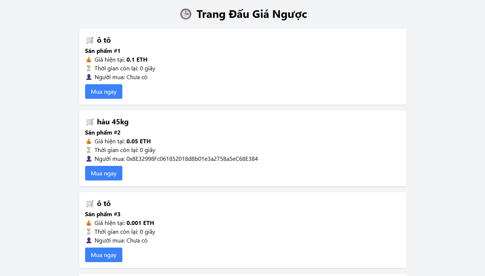

# 🛒 Dự án Đấu Giá Ngược Blockchain

Đây là một ứng dụng web mô phỏng **hệ thống đấu giá ngược** (Dutch Auction) được triển khai trên **smart contract Ethereum** (Sepolia Testnet), cho phép người bán tạo sản phẩm và người mua tham gia đấu giá với mức giá giảm dần theo thời gian.

## 🔗 Demo

Truy cập trang web demo tại: [https://trunq245.github.io/daugianguoc](https://trunq245.github.io/daugianguoc)

## 📌 Tính năng

- Tạo sản phẩm đấu giá với:
  - Giá khởi điểm
  - Giá tối thiểu (reserve)
  - Thời gian đấu giá
  - Tên sản phẩm
- Tự động cập nhật giá theo thời gian.
- Giao diện người dùng đơn giản và dễ sử dụng.
- Tích hợp ví MetaMask để thực hiện giao dịch.
- Hỗ trợ nhiều người dùng cùng truy cập và đấu giá.
- Giao diện admin tạo sản phẩm riêng biệt.

## 🧰 Công nghệ sử dụng

- **Smart Contract**: Solidity, Sepolia Testnet
- **Frontend**: HTML, CSS, JavaScript
- **Blockchain Interaction**: [ethers.js](https://docs.ethers.org/)
- **Triển khai giao diện**: GitHub Pages
- **Ví người dùng**: MetaMask
## 🖼 Giao diện người dùng

### Trang Admin (Tạo sản phẩm đấu giá)


---

### Trang Đấu giá (Người dùng xem và mua sản phẩm)



## ⚙️ Cách triển khai

### 1. Cài đặt và chạy cục bộ

```bash
git clone https://github.com/ten-cua-ban/daugianguoc.git
cd daugianguoc
# mở index.html bằng trình duyệt
